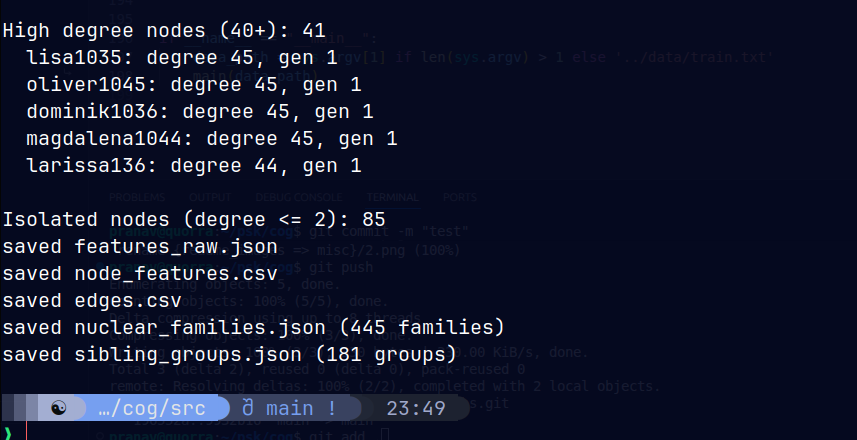

# FAILURES AND Evolution Report

## TASK 1

## Initial Approach (v1)

The first iteration used BFS generation inference, starting from people with no parents cause I had assumed them to be at the top of the tree and propagate kids downward through child edges. Gender was being inferred by counting unique relation types as given in the relation. 

Problems:
- Generation depth was just 3 levels (0-2) which seemed suspicious cause the data clearly had deeper family trees
- 94 gender conflicts reported, but these were because of treating all relations equally
- 390 generation conflicts flagged, most of which were false positives from the naive algorithm
- Anomaly detection flagged "single parent" cases which are normal in partial knowledge graphs

The statistics looked concerning but the cause was algorithmic, not data quality.

## Diagnosis

Manual tracing of specific cases (fabian26, olivia0) revealed the core issues:

1. Generation inference ignored aunt/uncle, cousin, grandparent relations that carry generation information
2. The "firstCousinOnceRemoved" relation was thought of in the wrong direction. and trust me I broke my head over this.
3. the head is actually the younger party, not older
4. Gender weights needed to reflect evidence strength: motherOf is definitive, girlCousinOf is merely suggestive

## Revised Approach (v2)

Switched to constraint propagation using all 28 relation types with proper generation deltas. More maths-ey. Each relation encodes a known generational offset, and these constraints propagate both ways up and down through the graph.

Results:
- Generation depth expanded to 7 levels (0-6)
- Gender conflicts dropped to 0 with weighted inference
- True generation conflicts dropped to 0 after fixing the cousin-once-removed direction

## v3 Architecture

Separated concerns into distinct modules:

- `constants.py`: Domain knowledge (relation semantics, generation deltas)
- `data_loader.py`: Pure I/O, no processing
- `feature_extractor.py`: Raw feature capture with no decisions
- `inference.py`: All thresholding and classification logic
- `graph_analysis.py`: Cross-person patterns and statistics

extraction captures everything including ambiguity; inference makes decisions but preserves reasoning. 
This allows reprocessing with different thresholds without re-extracting. Future usability. 

Thank DASS course for making me think ahead :)

## OUTPUT ON TERMINAL 

